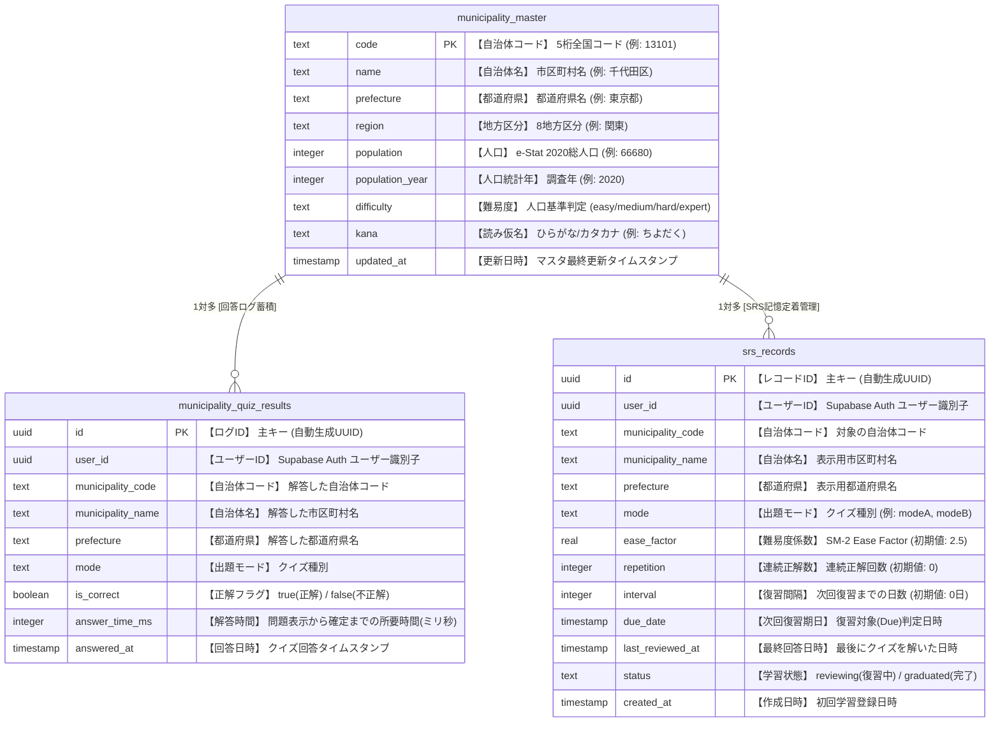

# 🗄️ データベース構造・カラム仕様書

GeoDojo のデータベース（PostgreSQL / Supabase）の構造と各テーブル・カラムの役割一覧です。  
ソースコードの正は [`lib/db/schema.ts`](../lib/db/schema.ts) に定義されています。

---

## 🗺️ 全体 ER 図 (Entity Relationship Diagram)

Mermaid の図内に**テーブルの役割**と各カラムの**日本語名・役割**を直接埋め込んでいます。

---

## 📋 テーブル＆カラム仕様一覧

### 1. `municipality_master` （市区町村マスタ）
> 💡 **役割**: 全国約1,700の市区町村の基本情報・人口・出題難易度バケットを保持する共有マスタデータ。e-Stat国勢調査データからバッチ投入されます。

| カラム名 | 物理名 | 型 | 制約 | 役割・取れる値の例 |
| :--- | :--- | :--- | :--- | :--- |
| **自治体コード** | `code` | `text` | **PK** | 全国地方公共団体コード 5桁 (例: `'13101'`) |
| **自治体名** | `name` | `text` | NOT NULL | 市区町村名 (例: `'千代田区'`, `'横浜市'`) ※政令市は親市名に集約 |
| **都道府県** | `prefecture` | `text` | NOT NULL | 都道府県名 (例: `'東京都'`, `'神奈川県'`) |
| **地方区分** | `region` | `text` | NOT NULL | 地方名 (例: `'北海道'`, `'東北'`, `'関東'`, `'中部'`, `'近畿'`, `'中国'`, `'四国'`, `'九州'`) |
| **人口** | `population` | `integer` | NULL可 | e-Stat 2020年国勢調査の総人口 (例: `66680`) |
| **人口統計年** | `population_year` | `integer` | NULL可 | 人口調査年 (例: `2020`) |
| **難易度** | `difficulty` | `text` | NOT NULL | 人口ベースで自動計算 (`'easy'` / `'medium'` / `'hard'` / `'expert'`) |
| **読み仮名** | `kana` | `text` | NULL可 | クイズ・検索用のひらがな・カタカナ (例: `'ちよだく'`) |
| **更新日時** | `updated_at` | `timestamp` | NOT NULL | マスタ同期スクリプトによる最終更新日時 |

---

### 2. `srs_records` （間隔反復学習ステータス）
> 💡 **役割**: ユーザー×自治体×モードごとの記憶定着度（SM-2アルゴリズムに基づく難易度係数・復習間隔・期日）を記録・管理します。

| カラム名 | 物理名 | 型 | 制約 | 役割・取れる値の例 |
| :--- | :--- | :--- | :--- | :--- |
| **ID** | `id` | `uuid` | **PK** | レコード識別子 (自動生成) |
| **ユーザーID** | `user_id` | `uuid` | NOT NULL | Supabase Auth ユーザーID |
| **自治体コード** | `municipality_code` | `text` | NOT NULL | 対象の自治体コード |
| **自治体名** | `municipality_name` | `text` | NOT NULL | 表示用自治体名 |
| **都道府県** | `prefecture` | `text` | NOT NULL | 都道府県名 |
| **出題モード** | `mode` | `text` | NOT NULL | クイズ種別 (例: `'modeA'`, `'modeB'`) |
| **難易度係数** | `ease_factor` | `real` | NOT NULL | SM-2 Ease Factor。復習間隔の倍率 (初期値: `2.5`) |
| **連続正解数** | `repetition` | `integer` | NOT NULL | 連続で正解した回数 (初期値: `0`) |
| **復習間隔** | `interval` | `integer` | NOT NULL | 次回復習までの日数 (初期値: `0` 日) |
| **次回復習期日** | `due_date` | `timestamptz` | NOT NULL | この日時を過ぎると復習対象（Due）として出題される |
| **最終復習日時** | `last_reviewed_at` | `timestamptz` | NULL可 | 最後にユーザーが解答した日時 |
| **ステータス** | `status` | `text` | NOT NULL | 学習状況 (`'reviewing'`: 復習中 / `'graduated'`: 定着完了) |
| **作成日時** | `created_at` | `timestamp` | NOT NULL | 初回出題・作成日時 |

---

### 3. `municipality_quiz_results` （クイズ回答履歴ログ）
> 💡 **役割**: ユーザーの過去すべてのクイズ回答ログ（正解・不正解・回答日時）を蓄積保存するテーブル。苦手傾向の分析などに使用されます。

| カラム名 | 物理名 | 型 | 制約 | 役割・取れる値の例 |
| :--- | :--- | :--- | :--- | :--- |
| **ID** | `id` | `uuid` | **PK** | ログ識別子 (自動生成) |
| **ユーザーID** | `user_id` | `uuid` | NOT NULL | Supabase Auth ユーザーID |
| **自治体コード** | `municipality_code` | `text` | NOT NULL | 対象の自治体コード |
| **自治体名** | `municipality_name` | `text` | NOT NULL | 解答した自治体名 |
| **都道府県** | `prefecture` | `text` | NOT NULL | 都道府県名 |
| **出題モード** | `mode` | `text` | NOT NULL | クイズ種別 |
| **正解フラグ** | `is_correct` | `boolean` | NOT NULL | 正解なら `true` / 不正解なら `false` |
| **解答時間** | `answer_time_ms` | `integer` | NULL可 | 出題表示から確定までの経過時間 (ミリ秒) (例: `3420`) |
| **回答日時** | `answered_at` | `timestamp` | NOT NULL | クイズ回答時のタイムスタンプ |
