# geo-dojo リファクタリング詳細設計・実行計画（第3版）

## 1. 意思決定・判断用サマリ（Executive Decision Sheet）

### 現状のコードベース規模
- **総行数**: 約 10,300 行（`app/` + `components/` + `lib/` の `.ts`/`.tsx`）
- **テスト**: 31 テストファイル / 183 テスト
- **主要な問題箇所**:
  - `app/(app)/dashboard/queries.ts` (933行 - Read クエリ肥大化)
  - `app/(app)/quiz/municipality/actions.ts` (361行 - Write Path 責務混在)
  - `components/quiz/quiz-runner.tsx` (462行 - モード混在・I/O未分離)
  - クイズ Setup/Result の UI 重複（市区町村 473行 vs 都道府県 554行）

---

### やること（Goals）vs やらないこと（Non-Goals）

```mermaid
graph TD
    subgraph やること (Goals)
        G1["1. queries.ts のドメイン分割<br/>(barrel再エクスポートで互換維持)"]
        G2["2. municipality/actions.ts の Write Path 分割<br/>(逐次書き込み維持・SRS/推薦抽出)"]
        G3["3. QuizRunner 境界テスト先行追加 ＋ 分割<br/>(saveResult DIテスト → View分離)"]
        G4["4. クイズ Setup / Result の UI 共通化<br/>(options/スロット設計・popstateフック)"]
        G5["5. Query Key Factory 導入<br/>(既存キー文字列完全維持・一括適用)"]
    end

    subgraph やらないこと (Non-Goals)
        NG1["× 都道府県クイズの QuizRunner 統合<br/>(DBなし/タイムアタック/独自モデルのため)"]
        NG2["× QueryKey の名前空間分割<br/>(invalidate('dashboard') と prefetch の連動破壊を防ぐ)"]
        NG3["× 15本のカスタムフック集約<br/>(壊れるリスクに対して可読性向上の恩恵が薄い)"]
        NG4["× 汎用 storage.ts の導入<br/>(ドメイン別管理を維持)"]
        NG5["× 既存の型・関数の再定義<br/>(municipality-data.ts, autofocus-bounds.ts 等は既存を活用)"]
    end
```

| 提案 | 目的・効果 | 主なリスク・設計上の注意点 |
|---|---|---|
| **1. `queries.ts` 分割** | 933行のモノリスを `dashboard.ts`, `srs.ts`, `sql-helpers.ts` に分割。保守性と見通しを劇的に改善。 | **リスク**: import 破損。<br/>**対策**: `app/(app)/dashboard/queries.ts` を barrel（再エクスポート）として残し、互換性を完全維持。`actions.ts` の `getReviewModeBreakdown` も `srs.ts` へ抽出し統一。 |
| **2. `municipality/actions.ts` 分割** | レートリミット、コード検証、SRS 更新、推薦ステート生成が混在した厚い Write Path (361行) を分離。 | **リスク**: 保存挙動の変化。<br/>**対策**: DB トランザクション化せず、現状の**逐次書き込み（quiz 保存成功・SRS 失敗で再 throw）の挙動を厳格に維持**。コード検証は DB（`municipality_master`）を情報源とし `fs` 読み込みは厳禁。Read 系は対象外。 |
| **3. `QuizRunner` 分割** | 462行のコンポーネントからセッション進行ロジックと各モードの View を分離。 | **リスク**: Mode A 正規化や保存エラーログのデグレ。<br/>**対策**: `saveResult` を引数注入（DI）した純粋な進行関数を先に切り出し、境界テスト（Mode A 集約、保存失敗ログ、Mode D タイムアウト）をパスさせてから View 分割へ進む。 |
| **4. Setup / Result UI 共通化** | 市区町村クイズと都道府県クイズで重複する UI（地域選択・問題数・ResultCard・離脱防止）を共通化。 | **リスク**: 選択肢やスロットの違いによる不整合。<br/>**対策**: 問題数セレクタは `options` 注入型、ResultCard は独自要素（UpcomingReview / ベストタイム）をスロット（children）で受ける設計にする。ランナー本体は統合しない。 |
| **5. Query Key Factory** | 文字列リテラルの散乱を防ぎ、キャッシュ無効化の型安全性を向上。 | **リスク**: キャッシュ不整合・残存。<br/>**対策**: 既存の `['dashboard', ...]` キー文字列を 100% 維持し、`prefetch.ts` / フック / `invalidate` を同一コミットで一括置換。 |

---

## 2. 詳細設計

---

### Proposal 1: `queries.ts` (933行) のドメイン分割と Barrel 互換性維持

#### 改善設計
1. **`lib/db/queries/` 配下にドメイン分割**:
   - `lib/db/queries/sql-helpers.ts`: `notSameNameSql`, `getClearedDistinctSql`, `getFilterCondSql`, `getMasterPoolSize`
   - `lib/db/queries/dashboard.ts`: `getDashboardSummaryData`, `getAccuracyTrendData`, `getCompletionTrendData`, `getWeaknessRankingData`, `getStreakData`, `getDifficultyProgressData`, `getCompletionByModeData`
   - `lib/db/queries/srs.ts`: `getDueReviewSummaryData`, `getUpcomingReviewScheduleData`, `getItemAccuracyData`, `getReviewItemListData`, `getReviewModeBreakdownData`
   - `lib/db/queries/serialization.ts`: `serialize`, `stripDates`
2. **Barrel 再エクスポートによる安全な移行**:
   - `app/(app)/dashboard/queries.ts` は削除せず、上記 `lib/db/queries/*.ts` から全関数・型を再エクスポートする。
   - これにより、`lib/dashboard/prefetch.ts`、`app/(app)/dashboard/actions.ts`、および `__tests__/lib/dashboard/queries-parity.test.ts` の import を壊さずに安全に移行できる。
3. **`dashboard/actions.ts` の整理**:
   - 直書きされていた `getReviewItemList` および `getReviewModeBreakdown` を `srs.ts` のデータ取得関数（`getReviewItemListData`, `getReviewModeBreakdownData`）呼び出しに置き換え、薄いコントローラに統一。
   - 既存テスト `__tests__/lib/dashboard/review-item-list-fallback.test.ts`（正答率取得失敗でも一覧を返すフォールバック）を確実にパス対象とする。

---

### Proposal 2: `app/(app)/quiz/municipality/actions.ts` (361行) の Write Path 分割

#### 改善設計
1. **認証の共通化 (`lib/auth/current-user.ts`)**:
   - `lib/auth/current-user.ts` に `requireUserId(): Promise<string>` を追加・エクスポートし、`municipality/actions.ts`, `review/actions.ts`, `dashboard/actions.ts` の認証取得を一元化。
2. **責務ごとのモジュール抽出**:
   - `lib/quiz/rate-limit.ts`: プロセス内 Map によるレートリミット判定 (`checkRateLimit`)
   - `lib/quiz/validation.ts`: 市区町村コードのキャッシュ・検証 (`getValidCodes`)。**情報源は必ず DB（`municipality_master`）とし、`fs` によるファイル読み込みは行わない（本番障害防止ルール厳守）**。
   - `lib/quiz/srs/record-service.ts`: `upsertSrsRecord`（`everWrong` 判定、`computeSrsUpdate`、DB upsert）
   - `lib/quiz/recommendation/state-builder.ts`: `buildLearnerState`（全結果取得、セッション推定、Fit Zone 抽出、苦手マップ構築）
3. **保存フローの不変条件（逐次書き込みの維持）**:
   - `db.transaction` は導入せず、**現状の「`municipalityQuizResults.insert` 成功後に `upsertSrsRecord` を逐次実行し、SRS 失敗時はエラーログを出力して再 throw する」挙動を維持**する。
4. **Read 系アクションのスコープ**:
   - 同じファイル内の `getMunicipalityWeakness` と `getMunicipalityMaster` は今回の Write Path 分割の対象外とし、既存のまま維持する。

---

### Proposal 3: `QuizRunner.tsx` のテスト先行 ＋ 責務分割

#### 改善設計（テスタビリティを考慮したテスト先行アプローチ）
1. **【先行ステップ】I/O境界を分離した進行ハンドラの抽出 & テスト作成**:
   - `recordAndAdvance` のコアロジックを、保存関数（`saveResult: (entry) => Promise<void>`）を引数で受け取る純粋なハンドラ関数として切り出す（コンポーネント全体を render/mock するのではなく、ロジックをテストする）。
   - `__tests__/components/quiz/quiz-runner-handler.test.ts` を新規作成し、以下をテスト（Red/Green 確認）：
     - **Mode A 正規化**: 複数県インスタンス保存時でも、`toQuestionResult` により表示用結果は 1問1件に集約されること。
     - **保存失敗ログ**: `saveResult` が reject された際、UX を止めずに `console.error` を出力すること。
     - **Mode D タイムアウト**: 制限時間経過時に `isCorrect: false` で保存処理がトリガーされること。
2. **`useQuizSession` カスタムフックの抽出**:
   - 上記テスト済みハンドラを内包し、`qIdx`, `feedback`, `results`, `selectedPrefectures`, `selectedChoice`, `timeLeft` の状態管理を提供。
3. **サブコンポーネントの分割**:
   - `components/quiz/quiz-header.tsx`: 中断ボタン、進捗、正解数、`MuteToggle`
   - `components/quiz/quiz-question-card.tsx`: 問題タイトル、難易度バッジ、正誤フィードバックメッセージ
   - `components/quiz/views/mode-a-view.tsx`: `JapanMap` + 都道府県選択バッジ + 送信ボタン
   - `components/quiz/views/choice-view.tsx`: 4択ボタングループ（Mode B / C 共通）
   - `components/quiz/views/municipality-map-view.tsx`: `MunicipalityMap` + カウントダウンバー + Mode C 代替フォールバック

---

### Proposal 4: クイズ設定・リザルト UI の共通化（スロット/Option設計）

#### 共通化のスコープ（純粋なプレゼンテーション層のみ）
- **都道府県クイズ（`quiz/prefecture/page.tsx`）は `QuizRunner` に統合しない（Non-Goal）**。
- 共通化は以下のプレゼンテーションコンポーネントとナビゲーションフックに限定する：

1. **`components/quiz/shared/region-selector.tsx`**:
   - 「全国」と個別地方の排他・トグルロジック（`toggleRegion`）を内包した地域選択 UI。
2. **`components/quiz/shared/count-selector.tsx`**:
   - 選択肢を固定化せず、`options: { value: T; label: string }[]` をジェネリックに受け取るボタングループ。
   - 市区町村クイズ: `[{ value: 10, label: '10問' }, { value: 20, label: '20問' }, { value: 30, label: '30問' }]`
   - 都道府県クイズ: `[{ value: 10, label: '10問' }, { value: 20, label: '20問' }, { value: 'all', label: `全問 (${max}問)` }]`
3. **`components/quiz/shared/quiz-result-card.tsx`**:
   - スコア表示（○ / ○問、正答率 %）、苦手リストタグ表示、アクションボタン群の標準レイアウト。
   - 固有の表示（市区町村の `UpcomingReviewMini`、都道府県のベストタイム更新バッジ）は `children` / スロットで受け取って描画。
4. **`lib/hooks/useQuizNavigationGuard.ts`**:
   - `phase === 'playing'` 中の `popstate` イベントによるブラウザバック検知（Setup 画面への安全な差し戻し）を共通フック化。

---

### Proposal 5: Query Key Factory の導入（既存キー完全維持 & 同一コミット一括置換）

#### 改善設計
1. **キー文字列は既存と 100% 同一を維持**:
   ```ts
   // lib/query-keys.ts
   export const queryKeys = {
     dashboard: {
       all: ['dashboard'] as const,
       summary: () => ['dashboard', 'summary'] as const,
       trend: (period: string, mode: string, region: string) =>
         ['dashboard', 'trend', period, mode, region] as const,
       completionTrend: (period: string, mode: string, region: string) =>
         ['dashboard', 'completionTrend', period, mode, region] as const,
       difficulty: (mode: string, region: string) =>
         ['dashboard', 'difficulty', mode, region] as const,
       completion: (mode: string, region: string) =>
         ['dashboard', 'completion', mode, region] as const,
       weakness: () => ['dashboard', 'weakness'] as const,
       streak: () => ['dashboard', 'streak'] as const,
       // SRS系も既存どおり 'dashboard' 配下のキーを維持（invalidate('dashboard') と連動）
       srsSummary: () => ['dashboard', 'srs-summary'] as const,
       srsSchedule: (days: number) => ['dashboard', 'srs-schedule', days] as const,
       srsList: (mode: string, page: number, pageSize: number) =>
         ['dashboard', 'srs-list', mode, page, pageSize] as const,
       srsModeBreakdown: () => ['dashboard', 'srs-mode-breakdown'] as const,
     },
     municipality: {
       all: ['municipality'] as const,
       master: () => ['municipality', 'master'] as const,
       weakness: () => ['municipality', 'weakness'] as const,
     },
     recommendation: () => ['recommendation'] as const,
   };
   ```
2. **同一コミットでの一括置換**:
   - `lib/query-keys.ts` の導入
   - `lib/dashboard/prefetch.ts` のキー参照更新
   - 既存の 15 本のフック（`lib/hooks/*.ts`）のキー参照更新
   - クイズ完了後の `invalidateQueries` 呼び出し箇所（`queryKeys.dashboard.all`）の更新
   - これらを**単一コミットで同時に適用**する。

---

## 3. やらないこと（Non-Goals / 明示的除外リスト）

1. **都道府県クイズの `QuizRunner` への統合**
   - 理由: データモデル、DB保存有無、タイマー精度（タイムアタック）、苦手管理方式が市区町村と根本的に異なるため。
2. **QueryKey 名前空間の分割（`['srs', ...]` 等への変更）**
   - 理由: `invalidateQueries({ queryKey: ['dashboard'] })` によるカスケード無効化と `prefetch.ts` のキャッシュ整合性を壊すため。
3. **15 本のカスタムフックの 1 ファイル集約**
   - 理由: 各フックはコンパクトであり、1 ファイルに集約しても可読性向上の恩恵が薄く、import 競合リスクの方が高い。個別ファイル構造を維持する。
4. **汎用 `storage.ts` の新設**
   - 理由: 現在ドメインごとに適切にカプセル化されており、汎用ラッパーを作る必要性が薄い。
5. **既存の共通関数・型の再定義**
   - `Municipality`, `GameMode`, `Difficulty`, `Region` は `lib/quiz/municipality-data.ts` を SSOT として維持。
   - `autofocus-bounds.ts` は既に存在するためそのまま活用。
6. **`municipality/actions.ts` の Read 系（`getMunicipalityWeakness`, `getMunicipalityMaster`）の移設**
   - 理由: 今回のスコープは Write Path の責務混在の解消に集中するため。

---

## 4. 段階的実装ロードマップ（PR 分割方針）

レビューしやすさと安全性を担保するため、以下の 5 ステップ（各ステップ 1 PR）で進めます。

```mermaid
gantt
    title リファクタリング実行ロードマップ
    dateFormat  X
    axisFormat  PR %d

    section PR 1: Read クエリ層分割
    lib/db/queries/ 分割 ＋ queries.ts barrel化 :pr1, 0, 1

    section PR 2: Write Path 分割
    requireUserId 共通化 ＋ Write Service 抽出 :pr2, after pr1, 2

    section PR 3: Query Key Factory
    query-keys.ts 作成 ＋ prefetch/hooks 一括更新:pr3, after pr2, 3

    section PR 4: QuizRunner 分割
    I/O分離テスト先行作成 ＋ useQuizSession & View 分離:pr4, after pr3, 4

    section PR 5: UI 共通化
    components/quiz/shared/ 作成 ＋ 画面適用    :pr5, after pr4, 5
```



### PR 1: Read クエリ層の分割【最優先・高効果】
- `lib/db/queries/`（`dashboard.ts`, `srs.ts`, `sql-helpers.ts`, `serialization.ts`）を作成。
- `app/(app)/dashboard/queries.ts` から上記を barrel 再エクスポート。
- `dashboard/actions.ts` の `getReviewItemList` / `getReviewModeBreakdown` を `srs.ts` 経由に統一。
- 検証: `pnpm type-check` && `pnpm test`（`queries-parity.test.ts`, `review-item-list-fallback.test.ts` 含む）

### PR 2: Write Path の分割【責務整理】
- `lib/auth/current-user.ts` に `requireUserId()` を追加し、各アクションで統一利用。
- `lib/quiz/rate-limit.ts`, `lib/quiz/validation.ts`, `lib/quiz/srs/record-service.ts`, `lib/quiz/recommendation/state-builder.ts` を抽出。
- `municipality/actions.ts` を薄いオーケストレータにスリム化（逐次書き込み維持）。
- 検証: `pnpm type-check` && `pnpm test` && `pnpm lint:ratchet`

### PR 3: Query Key Factory の導入【整合性確保】
- `lib/query-keys.ts` を作成（キー配列は既存完全一致）。
- `prefetch.ts`, 15本のフック, 各画面の `invalidateQueries` を一括置換。
- 検証: `pnpm type-check` && `pnpm test`

### PR 4: `QuizRunner` の境界テスト先行作成 ＋ 責務分割【安全なUI分離】
- `saveResult` を注入可能な進行ハンドラを抽出し、`__tests__/components/quiz/quiz-runner-handler.test.ts` を作成（Mode A 正規化、保存失敗ログ、Mode D タイムアウト）。
- `useQuizSession.ts` フックと `mode-a-view.tsx`, `choice-view.tsx`, `municipality-map-view.tsx` に分割。
- 検証: 新規テスト含む全テストパス。

### PR 5: クイズ Setup / Result UI の共通化【UI重複排除】
- `components/quiz/shared/` に `RegionSelector`, `CountSelector` (options注入型), `QuizResultCard` (スロット型), `useQuizNavigationGuard` を作成。
- 市区町村クイズ画面および都道府県クイズ画面の Setup / Result UI を置き換え。
- 検証: UI 動作確認、`pnpm test`、`pnpm audit:duplicates` で重複行減少を確認。

---

## 5. テスト・品質保証計画

1. **`queries-parity.test.ts` と静的型検査**:
   - `queries-parity.test.ts` はローカル DB + seed に対するスナップショットテストであるため、barrel 再エクスポートによる静的型検査（`tsc --noEmit`）と併せて安全性を担保する。
2. **純粋関数の単体テスト追加**:
   - `quiz-runner-handler.test.ts` で `saveResult` 境界をテスト。
   - `review-item-list-fallback.test.ts` 等の既存回帰テストのパスを維持。
3. **新規テストの Red/Green 検証**:
   - `.agents/rules/testing.instructions.md` に従い、新設するハンドラテスト等は意図的に失敗させてから修正し、テストの有効性を確認する。
4. **CI 検証ゲート**:
   - `pnpm type-check` (型検査)
   - `pnpm test` (回帰テスト全件パス)
   - `pnpm lint:ratchet` (警告ゼロ増加)
   - `pnpm audit:duplicates` (jscpd レポート確認)
