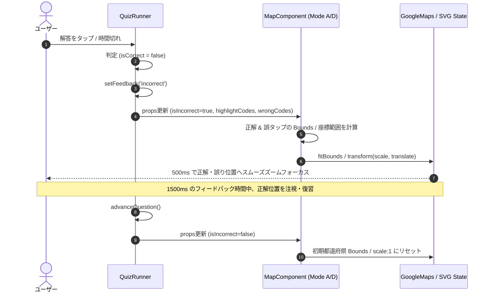

# Implementation Plan: 地図タップモード（Mode A/D）不正解時の自動フォーカス (B006)

**Feature ID**: `016-map-autofocus`  
**Plan Date**: 2026-08-07  
**Spec Document**: [spec.md](file:///Users/faru/geo-dojo/specs/016-map-autofocus/spec.md)  

---

## 概要

geo-dojo の地図タップ型クイズ（Mode D: 順引き市区町村タップ / Mode A: 逆引き都道府県タップ）において、不正解（タイムアウト含む）発生時に正解位置（および誤って選択した位置）の包含 Bounding Box へ地図を自動でスムーズパン・ズーム（フォーカス）させる機能を提供します。

---

## 技術的文脈 (Technical Context)

**言語/バージョン**: TypeScript (strict)、Next.js 15.2.6+（App Router / React 19）  
**主要な依存関係**: Google Maps JS API (`@googlemaps/js-api-loader`)、`@vnedyalk0v/react19-simple-maps` (TopoJSON)  
**ストレージ**: なし (純粋なクライアント地図表示・ビューポート制御)  
**テスト**: Vitest (`pnpm test`)。ロジック単体テスト (`autofocus-bounds.test.ts`) および コンポーネント統合テスト (`autofocus-integration.test.ts`)  
**対象プラットフォーム**: PWA（モバイルファースト 375px 基準、ダークモード `#111111`）  
**プロジェクトタイプ**: Web アプリケーション  
**パフォーマンス目標**: Bounds 計算 < 10ms、500ms アニメーションでスムーズな表示追従  
**制約事項**: 正解時 (`feedback === 'correct'`) はカメラ非移動、過度なズームイン防止 (非同期 `idle` リスナでの `zoom > 12` クランプ)

---

## 憲法チェック (Constitution Check)

| 原則 | 評価 | 判定 |
|------|------|------|
| **I. セキュリティ & コンプライアンス** | 新規 API キーの追加なし。`NEXT_PUBLIC_GOOGLE_MAPS_API_KEY` のみを使用し、サーバー専用環境変数のクライアント露出は一切行わない。 | ✅ 合格 (Pass) |
| **II. アーキテクチャ & パフォーマンス** | 地図データは既存の非同期 TopoJSON ロード (`/japan-municipalities.topojson`, `/japan.topojson`) をそのまま利用。新たな重い同期アセットは追加せず、Bounds 計算処理は純粋関数として分離してレイテンシ < 10ms を達成。 | ✅ 合格 (Pass) |
| **III. ロジック & UI** | 375px モバイル画面基準を前提とし、`fitBounds` 時の Padding（40px）を設定してヘッダーや画面端に要素が被らないよう配慮。ダークモードスタイル（`#111111`）を維持。正解時は画面を揺らさず現状維持する否定条件を遵守。 | ✅ 合格 (Pass) |
| **IV. コーディング規約** | TypeScript `strict` 徹底。計算ロジックは `lib/map/autofocus-bounds.ts` として切り出してTDDでテスト可能な構造を確保。 | ✅ 合格 (Pass) |

---

## 1. コンポーネント改修設計 (Component Refactoring)

### 1.1 `MunicipalityMap.tsx` (Mode D / Google Maps)

#### 追加・変更インターフェース (Props)
```typescript
interface MunicipalityMapProps {
  prefecture: string;
  onMunicipalityClick: (code: string, name: string) => void;
  highlightCodes?: string[];  // 正解の市区町村コード
  wrongCodes?: string[];      // 誤タップの市区町村コード
  isIncorrect?: boolean;       // 不正解状態フラグ（自動フォーカス起動用）
  qIdx?: number;               // 問題インデックス（問題切り替え時のリセットトリガー用）
  onLoadError?: () => void;
}
```

#### フォーカス計算 & 発動ロジック
1. `useEffect` で `isIncorrect` が `true` に変化した際をトリガーとする。
2. `dataLayerRef.current` から `highlightCodes` (正解) および `wrongCodes` (誤り) に一致する feature(s) を抽出。
3. `google.maps.LatLngBounds` オブジェクトを構築し、対象 feature(s) の全 `LatLng` を `bounds.extend(ll)` で追加。
4. 対象の `bounds` が有効な場合、`mapRef.current.fitBounds(bounds, { top: 40, right: 40, bottom: 40, left: 40 })` を発動。
5. **過度なズームイン防止 (非同期 Clamping)**: `fitBounds` による非同期のアニメーション・ビューポート適用完了を検知するため、`google.maps.event.addListenerOnce(map, 'idle', ...)`（または `zoom_changed`）でワンショットイベントをリスン。アニメーション確定後の `zoom` が `12` を超える（`zoom > 12`）場合のみ `map.setZoom(12)` でクランプし、周囲の地理コンテキスト（山脈海沿い・隣接市）が確実に視認できるように調整。
6. **問題リセット処理**: `qIdx` の変更または `feedback === 'idle'` 復帰時をトリガーとして、対象 `prefecture` 全体の Bounds へ `fitBounds` して初期表示に確定リセットする。

---

### 1.2 `JapanMap.tsx` (Mode A / Simple Maps SVG)

#### 追加・変更インターフェース (Props)
```typescript
interface JapanMapProps {
  onPrefectureClick: (name: string) => void;
  highlightCorrect?: string | string[];  // 正解都道府県
  highlightWrong?: string;               // 誤選択都道府県
  selectedNames?: string[];              // ユーザーが選択中の都道府県
  isIncorrect?: boolean;                 // 不正解状態フラグ（自動フォーカス起動用）
  qIdx?: number;                         // 問題インデックス（問題切り替え時のリセットトリガー用）
}
```

#### Bounds 計算 & 座標変換ロジック
1. **TopoJSON デコード**: デルタエンコードされた `japan.topojson`（Topology）から、`topojson-client` の `feature(topology, topology.objects[Object.keys(topology.objects)[0]])` を用いて、ポリゴン座標を持つ GeoJSON `FeatureCollection` へ明示的に復元・展開する。
2. **対象都道府県の座標抽出**: 復元された FeatureCollection より、正解 (`highlightCorrect`) および 誤選択 (`selectedNames`) に該当する都道府県 Feature(s) の Geometry 座標を抽出する。
3. **正確な Mercator 投影座標変換**: `ComposableMap` が実際に使用している描画設定と完全に一致するプロジェクション `d3-geo` の `geoMercator().center([138, 35]).scale(1000).translate([200, 250])`（400x500 ビューポート基準）を用いて、経緯度 `[lng, lat]` を SVG Viewport 投影座標 `[x, y]` へ変換し、対象要素の最小・最大 SVG 座標 `[minX, minY, maxX, maxY]` を算出する。
4. **`scale` & `translate` のコンテナ CSS Pixel 補正計算**:
   - 投影 Bounding Box の中心 `cx = (minX + maxX) / 2`, `cy = (minY + maxY) / 2` および幅・高さより、SVG viewBox 空間での `targetScale`（1〜8 の範囲）を算出する。
   - レスポンシブコンテナ (`375px` 等) における SVG の `preserveAspectRatio` (`meet`) レターボックス余白・拡大率を補正するため、描画コンテナ実サイズ `rect = containerRef.current.getBoundingClientRect()` から `svgContentScale = Math.min(rect.width / 400, rect.height / 500)` を算出する。
   - SVG viewBox オフセット `(200 - cx)`, `(250 - cy)` を CSS pixel 単位へ変換した `targetTranslate = { x: (200 - cx) * svgContentScale * targetScale, y: (250 - cy) * svgContentScale * targetScale }` を正確に算出し、画面アスペクト比に関わらず対象エリアが中央にフィットするように設定する。
5. `scale` と `translate` を更新し、CSS の smooth transition (`transition: transform 500ms cubic-bezier(0.16, 1, 0.3, 1)`) でアニメーション移動。
6. **問題リセット処理**: `qIdx` が変化して新しい問題に進んだ際（または `isIncorrect` が `false` に戻った際）、手動ズーム/パン位置をリセットし、`scale: 1, translate: { x: 0, y: 0 }` に確定スムーズ復元。

---

### 1.3 `QuizRunner.tsx` (クイズ進行オーケストレーション)

- `feedback === 'incorrect'` の場合、`JapanMap` / `MunicipalityMap` へ `isIncorrect={true}` を渡す。
- 問題切り替え時のリセットを確実にシグナルするため、`qIdx`（問題インデックス）を各地図コンポーネントに伝達する (`qIdx={qIdx}`)。
- これにより、正解判定時（`isIncorrect` が `false` のままのケース）や手動ズーム操作後でも、`advanceQuestion` による問題遷移 (`qIdx` インクリメント) で確実に初期カメラ構図へのリセット Effect がトリガーされる。

---

## 2. 処理フロー図 (Workflow)



---

## 3. テスト計画 (Testing Plan)

1. **ロジック単体テスト (`__tests__/lib/map/autofocus.test.ts`)**:
   - 複数座標・複数ポリゴンから正確な Union Bounding Box が算出できるか。
   - `scale` と `translate` の計算において 0 除算や 範囲外 (`scale < 1`, `scale > 8`) のガードが動作するか。
2. **コンポーネント統合テスト (`__tests__/components/map/autofocus-integration.test.ts`)**:
   - **前提条件**: Client Component マウントおよび `google.maps` / SVG 連携検証用 DOM テスト環境（`happy-dom` または lightweight DOM harness + Maps API Mock）の定義。
   - **不正解フォーカス**: 不正解時 (`isIncorrect: true`) に `fitBounds` または `setTranslate` が適切に呼ばれ、`idle` リスナで zoom 12 クランプが発動するか。
   - **正解時の否定テスト (FR-03.1)**: 初期表示 (`idle`) でコンポーネントをマウントして初期表示 `fitBounds` の呼び出しを確認後、スパイをクリア (`spy.mockClear()`) し、同一 `qIdx` のまま正解判定 (`isIncorrect: false` / `feedback === 'correct'`) へ再レンダリングした際、追加の `fitBounds` や SVG transform 呼び出しが発生しないことを確認。
   - **問題遷移リセット**: `qIdx` 更新（新しい問題遷移）時にカメラ位置および zoom / translate が初期構図へリセットされるか。
3. **回帰テスト・品質検証**:
   - `pnpm type-check`
   - `pnpm test`
   - `pnpm lint:ratchet`
