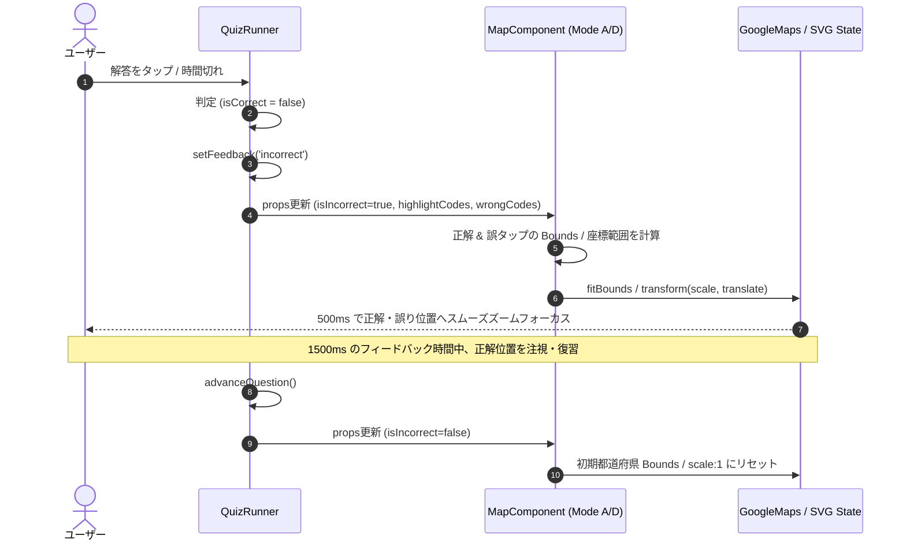

# Implementation Plan: 地図タップモード（Mode A/D）不正解時の自動フォーカス (B006)

**Feature ID**: `016-map-autofocus`  
**Plan Date**: 2026-08-07  
**Spec Document**: [spec.md](file:///Users/faru/geo-dojo/specs/016-map-autofocus/spec.md)  

---

## 1. コンポーネント改修設計 (Component Refactoring)

### 1.1 `MunicipalityMap.tsx` (Mode D / Google Maps)

#### 追加・変更インターフェース (Props)
```typescript
interface MunicipalityMapProps {
  prefecture: string;
  onMunicipalityClick: (code: string, name: string) => void;
  highlightCodes?: string[];  // 正解の市区町村コード
  wrongCodes?: string[];      // 誤タップの市区町村コード
  isIncorrect?: boolean;       // 不正解状態フラグ（自動フォーカス起動用）
  onLoadError?: () => void;
}
```

#### フォーカス計算 & 発動ロジック
1. `useEffect` で `isIncorrect` が `true` に変化した際をトリガーとする。
2. `dataLayerRef.current` から `highlightCodes` (正解) および `wrongCodes` (誤り) に一致する feature(s) を抽出。
3. `google.maps.LatLngBounds` オブジェクトを構築し、対象 feature(s) の全 `LatLng` を `bounds.extend(ll)` で追加。
4. 対象の `bounds` が有効な場合、`mapRef.current.fitBounds(bounds, { top: 40, right: 40, bottom: 40, left: 40 })` を発動。
5. **過度なズームイン防止**: `fitBounds` 直後に `zoom` が `13` を超える場合は `map.setZoom(12)` に制限して周辺の地理コンテキスト（山脈海沿い・隣接市）が視認できるように調整。
6. **問題リセット処理**: `isIncorrect` が `false`（`feedback === 'idle'`）に戻った際、再度 `prefecture` 全体の Bounds へ `fitBounds` して初期表示に戻す。

---

### 1.2 `JapanMap.tsx` (Mode A / Simple Maps SVG)

#### 追加・変更インターフェース (Props)
```typescript
interface JapanMapProps {
  onPrefectureClick: (name: string) => void;
  highlightCorrect?: string | string[];  // 正解都道府県
  highlightWrong?: string;               // 誤選択都道府県
  selectedNames?: string[];              // ユーザーが選択中の都道府県
  isIncorrect?: boolean;                 // 不正解状態フラグ（自動フォーカス起動用）
}
```

#### Bounds 計算 & 座標変換ロジック
1. `japan.topojson` 内の FeatureCollection より、正解 (`highlightCorrect`) および 誤選択 (`selectedNames`) の都道府県の全 Geometry 座標を抽出。
2. TopoJSON 経緯度 `[lng, lat]` の最小・最大値 `[minLng, minLat, maxLng, maxLat]` を取得。
3. `ComposableMap` の標準プロジェクション（`geoMercator` または `geoAlbers`）による Bounding Box または Viewport 座標へ変換。
4. コンテナサイズ（幅・高さ）に対して、対象領域が画面の 70% 程度を占める最適 `targetScale`（1〜8 の範囲）と中心位置合わせ用 `targetTranslate` (`{ x, y }`) を計算。
5. `scale` と `translate` を更新し、CSS の smooth transition (`transition: transform 500ms cubic-bezier(0.16, 1, 0.3, 1)`) でアニメーション移動。
6. **問題リセット処理**: `isIncorrect` が `false` に戻った際、`scale: 1, translate: { x: 0, y: 0 }` にスムーズ復元。

---

### 1.3 `QuizRunner.tsx` (クイズ進行オーケストレーション)

- `feedback === 'incorrect'` の場合、`JapanMap` / `MunicipalityMap` へ `isIncorrect={true}` を渡す。
- `advanceQuestion` 時（`feedback === 'idle'` に復帰時）、`isIncorrect` が `false` になり自動的に標準構図へ戻る。

---

## 2. 処理フロー図 (Workflow)



---

## 3. テスト計画 (Testing Plan)

1. **ロジック単体テスト (`__tests__/lib/map/autofocus.test.ts`)**:
   - 複数座標・複数ポリゴンから正確な Union Bounding Box が算出できるか。
   - `scale` と `translate` の計算において 0 除算や 範囲外 (`scale < 1`, `scale > 8`) のガードが動作するか。
2. **コンポーネント統合テスト**:
   - `feedback === 'incorrect'` 時に `fitBounds` または `setTranslate` が適切に呼ばれるか。
   - 新しい問題に進んだときに位置がリセットされるか。
3. **回帰テスト・品質検証**:
   - `pnpm type-check`
   - `pnpm test`
   - `pnpm lint:ratchet`
