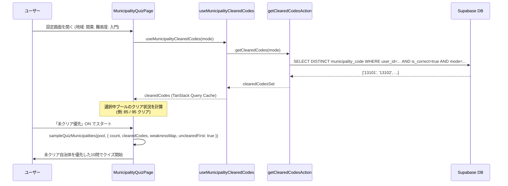

# Implementation Plan: 市区町村クイズの未制覇（未クリア）優先出題と進捗可視化

**Feature Branch**: `022-uncompleted-priority-quiz`  
**Prerequisites**: `spec.md` (required)

---

## 1. 概要 (Overview)

本機能は、市区町村クイズ（モード A, B, C, D）において、まだ正解していない自治体を優先して出題する「未クリア優先出題」と、クイズ設定時のリアルタイム進捗（クリア数/総数）表示を実装する。

### 主な変更点
1. **データ層**: ユーザーのモード別クリア済み自治体コード一覧（Set<string>）を返す Server Action と TanStack Query フックの追加。
2. **ロジック層（純粋関数）**: `lib/quiz/` に未クリア優先サンプリングロジック（`sampleQuizMunicipalities`）を実装。苦手優先（誤答重み）との併用、未クリア少数時の既クリア補充、Mode A 同名集約の正規化をカバー。
3. **UI層**: `/quiz/municipality/[mode]` の設定画面に「未クリア優先」トグルと「選択条件のクリア状況バッジ・プログレス」を追加。

---

## 2. アーキテクチャとデータフロー (Architecture & Data Flow)

---

## 3. Constitution Check

| Principle | Check Item | Status | Notes |
|---|---|---|---|
| **I. セキュリティ & コンプライアンス** | `user_id` による認証・認可スコープ | ✅ PASS | Server Action 内で `auth.uid()` スコープでクエリを実行し、他ユーザーの履歴漏洩を防止。 |
| **II. アーキテクチャ & パフォーマンス** | TanStack Query (Read) & Server Actions (Write) | ✅ PASS | クリア済みコード取得は Server Action + TanStack Query フック、キャッシュ無効化で整合性を維持。 |
| **III. ロジック & UI** | 375px モバイルファースト & ダークモード | ✅ PASS | 設定画面の進捗バー・トグルは 375px 幅およびダークモード（`#111111`）基準でレイアウト。 |

---

## 4. 詳細設計 (Detailed Design)

### 4.1 データ層 (Server Action, DB Index & Query Keys)

- **ファイル**: `lib/db/schema.ts`, `supabase/migrations/`
  - インデックス追加: `municipality_quiz_results` テーブルに `(user_id, mode, is_correct, municipality_code)` の複合インデックス `idx_municipality_quiz_results_cleared_lookup` を追加。
  - 大量のクイズ回答履歴が存在する場合でも、`user_id` + `mode` + `is_correct = true` のクリア済みコード DISTINCT 取得クエリが高速にインデックスオンリースキャンで完結するように最適化（SC-002: 1秒以内を保証）。
  - マイグレーション SQL の生成と `docs/db-schema.md` の同期更新。
- **ファイル**: `app/(app)/quiz/municipality/actions.ts`
  - 関数: `getClearedMunicipalityCodes(mode: GameMode): Promise<string[]>`
    - クエリ: `municipality_quiz_results` から `userId = auth.uid()`, `mode = mode`, `isCorrect = true` の `municipalityCode` を `DISTINCT` 取得。
  - 関数: `getMunicipalityWeakness(mode?: GameMode): Promise<MunicipalityWeakness[]>`
    - 既存のグローバル上限 100 件（`.limit(100)`）を撤廃し、選択地域・全自治体の苦手重み付け判定に必要な全誤答行を取得できるように改修（または指定プールの誤答率を漏れなく集計）。
- **ファイル**: `lib/query-keys.ts`
  - `queryKeys.quiz.clearedCodes(mode: string)` を追加。
- **ファイル**: `lib/hooks/useMunicipalityClearedCodes.ts`
  - TanStack Query フックを追加（`staleTime: 1分`）。クイズ結果保存時および中断時にキャッシュ無効化。

### 4.2 ロジック層 (純粋関数)

- **ファイル**: `lib/quiz/sampling.ts`（新規作成または `municipality-data.ts`）
  - 関数: `sampleMunicipalityPool(pool, options)`, `computePoolStats(...)`, `buildQuizQuestions(...)`
  - **乱数依存の注入 (RNG Injection)**:
    - 純粋関数としてのテスタビリティと決定性を確保するため、`SamplePoolOptions` に `random?: () => number`（デフォルト `Math.random`）を受け取るインターフェースを定義。シャッフルおよび重み付きサンプリングの乱数境界へ注入し、テストでの flaky（確率的不安定性）を排除する。
  - **モード別クリア状態集約ルール (Clear-State Aggregation & Cross-Difficulty Support)**:
    - **難易度を跨ぐ同一出題単位の解決**: 政令指定都市の区や同名自治体が難易度バケットを跨ぐ場合でも正確に判定できるよう、出題プール（難易度・地域フィルター後）だけでなく、全マスターデータから構築した出題単位コードマップ（`identityCodeMap` または全マスタ参照）をサンプラーおよび `computePoolStats` に注入。難易度外の兄弟コードでクリア保存されている場合でも確実にクリア済みとして集約判定する。
    - **Mode A**: 自治体名（`name`）単位で集約。同名自治体（全国で同名の市や政令市の区）の全インスタンスのうちいずれかのコードが `clearedCodes` に含まれていればクリア済みと判定。
    - **Mode B / Mode C / Mode D**: 出題単位である `(name, prefecture)` 単位で集約。同一県・同一市名（政令指定都市の複数区など、出題・正誤判定が集約されているもの）のいずれかのコードが `clearedCodes` に含まれていればクリア済みと判定。
  - **出題単位ごとの苦手スコア集約ルール (Weakness Score Aggregation)**:
    - **Mode A**: 同名全インスタンスの誤答率の最大値（`Math.max(...)`）をその名称の誤答率重みとして採用。
    - **Mode B / Mode C / Mode D**: 同一 `(name, prefecture)` に属する区・インスタンスの誤答率の最大値を重みとして採用。
  - **進捗集計ロジック (`computePoolStats`)**:
    - 生のレコード行数（`filtered.length`）ではなく、出題単位（Mode A は `name`、Mode B/C/D は `(name, prefecture)`）ごとにグループ化した母数を `totalCount`、そのうちクリア済みの出題グループ数を `clearedCount` として集約計算（政令市の区重複による母数水増しを防止）。
  - **優先順位ルール**:
    1. `unclearedFirst = true` の場合:
       - 対象モードの集約ルールに基づいてプールを「未クリア群」と「既クリア群」に分割。
       - 未クリア群の中で、`weaknessFirst = true` なら集約された誤答率に基づく重み付きサンプリング、そうでなければランダムシャッフル（注入された `random` を使用）。
       - 未クリア群から最大 `count` 件を抽出。
       - 不足分（未クリア件数 < `count`）があれば、既クリア群から（`weaknessFirst` に応じて）補充。
    2. `unclearedFirst = false` の場合:
       - 従来通り全プールから `weaknessFirst` またはランダムシャッフルで抽出。

### 4.3 UI層 (クイズ設定画面)

- **ファイル**: `app/(app)/quiz/municipality/[mode]/page.tsx`
  - 状態: `settings.unclearedFirst: boolean` (デフォルト `true`)
  - 選択中の地域×難易度における総件数 `totalCount` とクリア件数 `clearedCount` を算出（`computePoolStats` を使用）。
  - 地域・難易度セレクターの近くに「進捗表示（例: `85 / 95問 クリア (89%)`）」をインライン配置。
    - **進捗表示の独立したローディング・エラー状態**: `unclearedFirst` トグルの ON/OFF に関係なく、`clearedCodes` クエリのローディング中はスケルトン/スピナー、エラー時は「進捗読み込み失敗（再試行）」を表示し、誤った `0 / total` 表示を防止する（`unclearedFirst: false` の場合は通常スタートをブロックしない）。
  - チェックボックス: `未クリア優先モード`（初期値 ON）
  - **ローディング・再取得・エラーガード (Loading, Fetching & Error Guards)**:
    - `unclearedFirst: true` の場合は `clearedCodes` クエリの `isLoading || isFetching || isError`、`weaknessFirst: true` の場合は `weakness` クエリの `isLoading || isFetching || isError` をそれぞれ判定し、該当クエリが準備完了するまで手動スタートボタンを無効化（ローディング/再取得中は「データ読み込み中...」、エラー時は「データ取得に失敗しました」と表示しリトライ可能にする）。
    - **推薦セッションでも未クリア優先を適用**: `source=recommend` の自動開始は、推薦エンジンが決めたモード・地域・難易度・問数のプールに対し、手動スタートと同じ `settings`（`unclearedFirst` 既定 ON）で `buildQuestions` する。推薦の `codes` 履歴は重複回避用であり、出題サンプリングを上書きしない。クリア済みコード（および `weaknessFirst` 時は苦手）クエリが成功するまで自動開始しない（空のクリア集合で「全問未クリア」と誤認しない）。
    - **クイズ実行層からの保留中保存公開と遅延タイマー破棄**:
      - `components/quiz/use-quiz-actions.ts` / `QuizRunner` から回答保存の非同期処理を追跡する `awaitPendingSaves(): Promise<void>` を公開。
      - 中断（abort）時はスケジュール済みのフィードバック遅延タイマー（`advanceTimer`）を確実に `clearTimeout` で破棄し、中断後に `onComplete` が発火して結果画面へ誤遷移することを抑止。
      - **ブラウザバック (Popstate) の統合**: `usePopstateGuard` による戻る操作時もヘッダーの「中断」ボタンと同一の同期 exit ハンドラ（`handleAbort`）を経由させ、保留中保存の待機・タイマー破棄・キャッシュ再フェッチを確実に実行する。
      - セッション終了時（完了、中断、popstate 戻る、リプレイ）に `page.tsx` が `awaitPendingSaves()` を await してからキャッシュ無効化・再フェッチを実行。
    - **遅延再フェッチ設計**: クイズ回答中の保存時は `queryClient.invalidateQueries({ refetchType: 'none' })` でキャッシュを stale マークするのみとし、毎問の不要なバックグラウンド通信を抑止。セッション終了時（完了、中断、リプレイ）に上記 `awaitPendingSaves()` の完了を待機した上で 1 回だけ `clearedCodes` および `weakness` の再フェッチを実行・完了を待機する。
    - クイズ完了後・中断後の「もう一度（Replay）」押下時も、上記再フェッチ完了（`!isFetching`）を待ってから次セッションの出題サンプリングを実行し、直前に回答・誤答した自治体の出題・重み付け齟齬を完全に防止する。

---

## 5. テスト計画 (Testing Plan)

- `__tests__/lib/quiz/sampling.test.ts`:
  - 未クリアが多数ある場合の選出テスト
  - 未クリアが少数（例: 2件）で既クリアから8件補充されるテスト
  - 未クリアが0件（制覇完了）のときのフォールバック動作テスト
  - `weaknessFirst` と `unclearedFirst` が両方有効なときの優先度テスト（出題単位の苦手集約検証含む）
  - Mode A の同名自治体集約時の選出テスト
  - 難易度を跨ぐ政令指定都市の区コード・同名自治体のクリア判定集約回帰テスト
- `__tests__/lib/quiz/recommend-auto-start.test.ts`:
  - `source=recommend` 自動開始が `unclearedFirst` ON 時にクリア済みクエリ成功を待つこと
- `__tests__/server/cleared-codes.test.ts`:
  - Server Action のクエリ正当性・認証ガード・戻り値テスト
- 回帰テスト:
  - `pnpm type-check`, `pnpm test`, `pnpm lint:ratchet`

---

## 6. ロールアウトとマイグレーション (Rollout & Migration)

- `municipality_quiz_results` に `(user_id, mode, is_correct, municipality_code)` の複合インデックスを追加する DDL マイグレーション（`supabase/migrations/`）を作成・適用する。
- スキーマ変更に伴い `docs/db-schema.md` を更新する。
- キャッシュ（TanStack Query）により、設定画面での地域切り替え時もローカル計算で即座に進捗バーが反応する。
