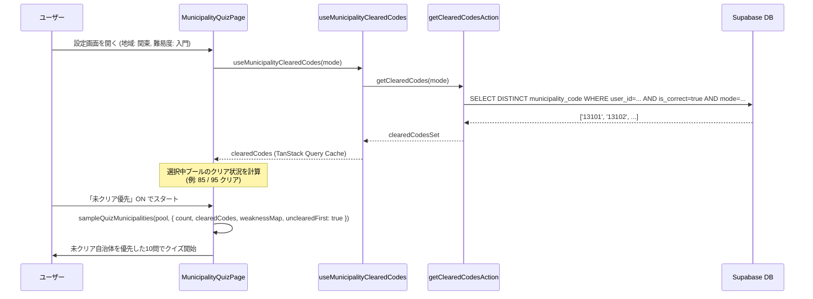

# Implementation Plan: 市区町村クイズの未制覇（未クリア）優先出題と進捗可視化

**Feature Branch**: `022-uncompleted-priority-quiz`  
**Prerequisites**: `spec.md` (required)

---

## 1. 概要 (Overview)

本機能は、市区町村クイズ（モード A, B, C, D）において、まだ正解していない自治体を優先して出題する「未クリア優先出題」と、クイズ設定時のリアルタイム進捗（クリア数/総数）表示を実装する。

### 主な変更点
1. **データ層**: ユーザーのモード別クリア済み自治体コード一覧（Set<string>）を返す Server Action と TanStack Query フックの追加。
2. **ロジック層（純粋関数）**: `lib/quiz/` に未クリア優先サンプリングロジック（`sampleQuizMunicipalities`）を実装。苦手優先（誤答重み）との併用、未クリア少数時の既クリア補充、Mode A 同名集約の正規化をカバー。
3. **UI層**: `/quiz/municipality/[mode]` の設定画面に「未クリア優先」トグルと「選択条件のクリア状況バッジ・プログレス」を追加。

---

## 2. アーキテクチャとデータフロー (Architecture & Data Flow)

---

## 3. Constitution Check

| Principle | Check Item | Status | Notes |
|---|---|---|---|
| **I. セキュリティ & コンプライアンス** | `user_id` による認証・認可スコープ | ✅ PASS | Server Action 内で `auth.uid()` スコープでクエリを実行し、他ユーザーの履歴漏洩を防止。 |
| **II. アーキテクチャ & パフォーマンス** | TanStack Query (Read) & Server Actions (Write) | ✅ PASS | クリア済みコード取得は Server Action + TanStack Query フック、キャッシュ無効化で整合性を維持。 |
| **III. ロジック & UI** | 375px モバイルファースト & ダークモード | ✅ PASS | 設定画面の進捗バー・トグルは 375px 幅およびダークモード（`#111111`）基準でレイアウト。 |

---

## 4. 詳細設計 (Detailed Design)

### 4.1 データ層 (Server Action & Query Keys)

- **ファイル**: `app/(app)/quiz/municipality/actions.ts`
  - 関数: `getClearedMunicipalityCodes(mode: GameMode): Promise<string[]>`
  - クエリ: `municipality_quiz_results` から `userId = auth.uid()`, `mode = mode`, `isCorrect = true` の `municipalityCode` を `DISTINCT` 取得。
- **ファイル**: `lib/query-keys.ts`
  - `queryKeys.quiz.clearedCodes(mode: string)` を追加。
- **ファイル**: `lib/hooks/useMunicipalityClearedCodes.ts`
  - TanStack Query フックを追加（`staleTime: 1分`）。クイズ結果保存時にキャッシュ無効化。

### 4.2 ロジック層 (純粋関数)

- **ファイル**: `lib/quiz/sampling.ts`（新規作成または `municipality-data.ts`）
  - 関数: `sampleMunicipalityPool(pool, options)`, `computePoolStats(...)`, `buildQuizQuestions(...)`
  - **乱数依存の注入 (RNG Injection)**:
    - 純粋関数としてのテスタビリティと決定性を確保するため、`SamplePoolOptions` に `random?: () => number`（デフォルト `Math.random`）を受け取るインターフェースを定義。シャッフルおよび重み付きサンプリングの乱数境界へ注入し、テストでの flaky（確率的不安定性）を排除する。
  - **モード別クリア状態集約ルール (Clear-State Aggregation)**:
    - **Mode A**: 自治体名（`name`）単位で集約。同名自治体（全国で同名の市や政令市の区）の全インスタンスのうちいずれかのコードが `clearedCodes` に含まれていればクリア済みと判定。
    - **Mode B / Mode C**: `(name, prefecture)` 単位で集約。同一県・同一市名（政令市の区など）のいずれかのコードが `clearedCodes` に含まれていればクリア済みと判定。
    - **Mode D**: 自治体コード（`code`）単位で直接判定。
  - **出題単位ごとの苦手スコア集約ルール (Weakness Score Aggregation)**:
    - **Mode A**: 同名全インスタンスの誤答率の最大値（`Math.max(...)`）をその名称の誤答率重みとして採用。
    - **Mode B / Mode C**: 同一 `(name, prefecture)` に属する区・インスタンスの誤答率の最大値を重みとして採用。
    - **Mode D**: 自治体コードごとの誤答率を直接適用。
  - **優先順位ルール**:
    1. `unclearedFirst = true` の場合:
       - 対象モードの集約ルールに基づいてプールを「未クリア群」と「既クリア群」に分割。
       - 未クリア群の中で、`weaknessFirst = true` なら集約された誤答率に基づく重み付きサンプリング、そうでなければランダムシャッフル（注入された `random` を使用）。
       - 未クリア群から最大 `count` 件を抽出。
       - 不足分（未クリア件数 < `count`）があれば、既クリア群から（`weaknessFirst` に応じて）補充。
    2. `unclearedFirst = false` の場合:
       - 従来通り全プールから `weaknessFirst` またはランダムシャッフルで抽出。

### 4.3 UI層 (クイズ設定画面)

- **ファイル**: `app/(app)/quiz/municipality/[mode]/page.tsx`
  - 状態: `settings.unclearedFirst: boolean` (デフォルト `true`)
  - 選択中の地域×難易度における総件数 `totalCount` とクリア件数 `clearedCount` を算出。
  - 地域・難易度セレクターの近くに「進捗表示（例: `85 / 95問 クリア (89%)`）」をインライン配置。
  - チェックボックス: `未クリア優先モード`（初期値 ON）

---

## 5. テスト計画 (Testing Plan)

- `__tests__/lib/quiz/sampling.test.ts`:
  - 未クリアが多数ある場合の選出テスト
  - 未クリアが少数（例: 2件）で既クリアから8件補充されるテスト
  - 未クリアが0件（制覇完了）のときのフォールバック動作テスト
  - `weaknessFirst` と `unclearedFirst` が両方有効なときの優先度テスト（出題単位の苦手集約検証含む）
  - Mode A の同名自治体集約時の選出テスト
- `__tests__/server/cleared-codes.test.ts`:
  - Server Action のクエリ正当性・認証ガード・戻り値テスト
- 回帰テスト:
  - `pnpm type-check`, `pnpm test`, `pnpm lint:ratchet`

---

## 6. ロールアウトとリスク

- 既存のDBテーブル（`municipality_quiz_results`）をインデックス走査して集計するため、新規テーブルやマイグレーションは不要。
- キャッシュ（TanStack Query）により、設定画面での地域切り替え時もローカル計算で即座に進捗バーが反応する。
