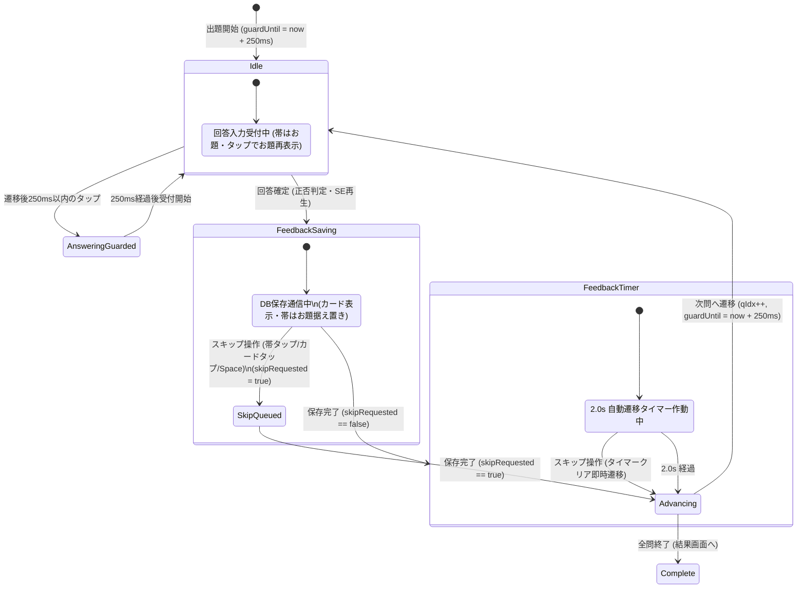

# Phase 1 Data Model: クイズ解答時のリッチフィードバック演出と補足情報表示

**Feature**: `029-rich-answer-feedback`  
**Date**: 2026-09-20  
**Status**: Complete  

---

## 1. 拡張データモデル (Extended Entities)

### 1.1 Municipality（市区町村モデル拡張）

`lib/quiz/municipality-data.ts` の `Municipality` 型定義に `population` を追加する。

```typescript
export interface Municipality {
  code: string;
  name: string;
  prefecture: string;
  region: string;
  difficulty?: Difficulty;
  kana?: string;
  /** 国勢調査2020人口（e-Stat由来）。未設定時は undefined */
  population?: number;
}
```

- **取得元**: DB テーブル `municipality_master.population`（integer, nullable）。
- **マッピング箇所**:
  - `app/(app)/quiz/municipality/[mode]/page.tsx`
  - `app/(app)/quiz/review/page.tsx`
  - `population: m.population ?? undefined`

---

## 2. フィードバック補足情報モデル (Feedback Data Structures)

### 2.1 FeedbackPopulationItem（県別・市区町村別補足情報）

解答フィードバック時に表示する市区町村の補足情報単位。Mode A の同名多県では配列として複数件保持される。

```typescript
export interface FeedbackMunicipalityItem {
  /** 都道府県名（例: "千葉県", "北海道"） */
  readonly prefecture: string;
  /** 市区町村名（例: "館山市", "池田町"） */
  readonly name: string;
  /** ひらがな読み（例: "たてやまし", "いけだまち"） */
  readonly kana?: string;
  /** 表示用人口（数値）。欠損時や政令市一部欠損時は null */
  readonly population: number | null;
  /** 整形済み人口表記（例: "約4.4万人", "約6,320人"）。population が null の場合は null */
  readonly formattedPopulation: string | null;
}

export interface FeedbackDetailData {
  /** 正解・不正解 */
  readonly isCorrect: boolean;
  /** 代表難易度（☆ 入門 〜 ☆☆☆☆ 達人） */
  readonly difficulty?: Difficulty;
  /** 補足情報リスト（単一自治体の場合は要素数1、Mode A 同名多県時は要素数 2〜4） */
  readonly items: readonly FeedbackMunicipalityItem[];
}
```

### 2.2 人口丸め規則（Validation & Formatting Rules）

FR-002d に従う人口表記フォーマット:

| 人口区分 | 規則 | 入力例 | 出力例 |
|---|---|---|---|
| 10,000人以上 | `(pop / 10000).toFixed(1)` で小数第2位を四捨五入 | `44,120` | `約4.4万人` |
| 100万人以上 | 同一基準（小数第2位四捨五入） | `2,753,862` | `約275.4万人` |
| 10,000人未満 | `Math.round(pop).toLocaleString()` で1の位までカンマ区切り | `6,320` | `約6,320人` |
| null または 0 | 人口表記自体を非表示（null） | `null`, `0` | `null` (非表示) |
| 政令市一部区欠損 | 1区でも欠損時は市人口全体を非表示（null） | 一部区が `null` | `null` (非表示) |

---

## 3. 連続正解（Streak）と演出段階モデル

### 3.1 Streak 状態

`lib/quiz/quiz-session-core.ts` または `lib/quiz/streak.ts` において、`QuizResultEntry[]` から純粋関数で算出される。

```typescript
/**
 * クイズ結果リストの末尾から連続正解数（Streak）を算出する。
 * 不正解、タイムアウト、セッション開始、中断再開直後は 0。
 */
export function calculateStreak(results: readonly { correct: boolean }[]): number {
  let count = 0;
  for (let i = results.length - 1; i >= 0; i--) {
    if (results[i].correct) {
      count++;
    } else {
      break;
    }
  }
  return count;
}
```

### 3.2 演出段階（PraiseStage）

連続正解数に応じてステップアップする称賛文言・チップ・音程・視覚効果の対応表:

```typescript
export interface PraiseStage {
  /** 連続正解数 */
  readonly streak: number;
  /** 称賛ラベル（FR-006a） */
  readonly label: string;
  /** 「n連続」チップを表示するか */
  readonly showStreakBadge: boolean;
  /** 和音SEのピッチシフト半音数（FR-005b）: 0, 2, 4, 6 (全音単位、最大4段階) */
  readonly pitchShiftSemitones: number;
  /** ファンファーレSE（0.34s）を鳴らすか（FR-005c: streak === 5 のみ） */
  readonly isFanfare: boolean;
  /** CSS紙吹雪演出を発火するか（FR-006b: streak === 5 のみ、1セッション最大1回） */
  readonly showConfetti: boolean;
}
```

段階対応表:

| streak | label | showStreakBadge | pitchShiftSemitones | isFanfare | showConfetti | 備考 |
|---|---|---|---|---|---|---|
| 0 (不正解) | 「不正解」 | false | 0 (ブブー音) | false | false | 不正解時 |
| 1 | 「正解！」 | false | 0 (基準音) | false | false | 単発正解 |
| 2 | 「いいね！」 | true (`2連続`) | +2 (全音上) | false | false | 2連続 |
| 3 | 「お見事！」 | true (`3連続`) | +4 (2全音上) | false | false | 3連続 |
| 4 | 「すごい！」 | true (`4連続`) | +6 (3全音上) | false | false | 4連続 (最高音程) |
| 5 | 「完璧！」 | true (`5連続`) | +6 | **true** (ファンファーレ) | **true** (紙吹雪) | **5連続達成時のみ** |
| 6+ | 「完璧！」 | true (`${n}連続`) | +6 (最高音程維持) | false (通常和音) | false | 演出乱発防止 |

---

## 4. UI 状態モデル (UI State & Transition)

### 4.1 FloatingFeedbackCardProps

HUDステージ上部に表示されるフローティングカードのプロパティ。

```typescript
export interface FloatingFeedbackCardProps {
  /** 正解・不正解 */
  readonly isCorrect: boolean;
  /** 連続正解数 */
  readonly streak: number;
  /** 代表難易度 */
  readonly difficulty?: Difficulty;
  /** 自治体情報アイテム群（多県時は複数） */
  readonly items: readonly FeedbackMunicipalityItem[];
  /** カード本体タップ時のスキップハンドラ */
  readonly onSkip: () => void;
}
```

### 4.2 進行制御と誤タップガード状態

`use-quiz-actions.ts` 内部で保持するライフサイクル参照:

```typescript
interface QuizAdvanceControl {
  /** 保存Server Actionの実行中プロミスを保持 */
  inFlightSavesRef: React.MutableRefObject<Set<Promise<unknown>>>;
  /** 保存完了後の 2.0s 自動遷移タイマー */
  advanceTimerRef: React.MutableRefObject<NodeJS.Timeout | null>;
  /** 保存通信中にユーザーからスキップが要求されたかのフラグ (FR-004b) */
  skipRequestedRef: React.MutableRefObject<boolean>;
  /** 次問遷移後の誤タップガード期限タイムスタンプ (FR-004d, 遷移時刻 + 250ms) */
  guardUntilRef: React.MutableRefObject<number>;
  /** 中断済みフラグ */
  isAbortedRef: React.MutableRefObject<boolean>;
}
```

### 4.3 状態遷移図 (State Transitions)


