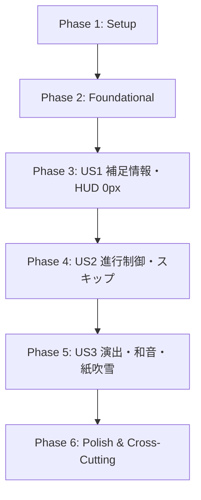

# Tasks: クイズ解答時のリッチフィードバック演出と補足情報表示

**Feature**: `029-rich-answer-feedback`  
**Date**: 2026-09-20  
**Spec**: [specs/029-rich-answer-feedback/spec.md](file:///Users/faru/geo-dojo/specs/029-rich-answer-feedback/spec.md)  
**Plan**: [specs/029-rich-answer-feedback/plan.md](file:///Users/faru/geo-dojo/specs/029-rich-answer-feedback/plan.md)  
**Implementation Order**: **US1 (補足情報表示・HUD 0px 固定) → US2 (進行制御・スキップ・誤タップガード) → US3 (演出・和音 SE・紙吹雪)** (リスク昇順)

---

## Phase 1: Setup (Shared Infrastructure)

**Purpose**: プロジェクト全体の共通型定義およびマスターデータマッピングの更新

- [x] T001 `lib/quiz/municipality-data.ts` の `Municipality` 型に `population?: number` プロパティを追加
- [x] T002 [P] `app/(app)/quiz/municipality/[mode]/page.tsx` のデータマッピングに `population: m.population ?? undefined` を追加
- [x] T003 [P] `app/(app)/quiz/review/page.tsx` のデータマッピングに `population: m.population ?? undefined` を追加

---

## Phase 2: Foundational (Blocking Prerequisites)

**Purpose**: 全ユーザーストーリー共通の純粋計算ロジック、データ整形、Streak 算出、およびその単体テスト

**⚠️ CRITICAL**: ユーザーストーリーの実装開始前に本フェーズの完了とテスト通過が必須

- [x] T004 [P] `lib/quiz/municipality-population.ts` を新設し、政令市全区人口合算 `buildDesignatedCityPopulationMap`（一部区欠損時は null）と人口表記フォーマット `formatPopulation`（小数第2位を四捨五入し『約○.○万人』、1万人未満カンマ区切り『約○,○○○人』、FR-002d 準拠）の純粋関数を実装
- [x] T005 [P] `lib/quiz/streak.ts` を新設し、クイズ結果 `QuizResultEntry[]` の末尾から連続正解数を算出する純粋関数 `calculateStreak` を実装
- [x] T006 [P] `__tests__/lib/quiz/municipality-population.test.ts` を新設し、政令市全区合算・欠損防御・四捨五入・カンマ区切りフォーマットの単体テストを作成
- [x] T007 [P] `__tests__/lib/quiz/streak.test.ts` を新設し、連続正解数算出・誤答リセット・タイムアウトリセット・Mode A 1問1件正規化の単体テストを作成

**Checkpoint**: 共通データ層・純粋関数が揃い、単体テストがすべてパスしていること

---

## Phase 3: User Story 1 - 解答時の補足情報表示（難易度・人口・HUD 0px 固定）(Priority: P1) 🎯 MVP

**Goal**: クイズ解答時に、正解市区町村の難易度・人口（政令市合算・池田町4県併記対応）を TopHud 直下の不透明フローティングカード（HUD経路）または問題カード内（カード経路）に表示し、下部帯はお題据え置き・0px 変動を同一ステップで適用して中間壊れを防ぐ。

**Independent Test**: モードA・B・C・D、カード経路・HUD経路のそれぞれで解答した際、補足情報が正しい単位・レイアウト（池田町4県が 112px 内に収まる）で表示され、解答瞬間に下部帯の高さが一切変動しないこと。

### Tests for User Story 1 ⚠️

- [x] T008 [P] [US1] `__tests__/lib/quiz/hud-metrics.test.ts` を新設し、解答フィードバック中の帯高さ 0px 変動保証と廃止定数の回帰テストを作成
- [x] T009 [P] [US1] `__tests__/components/quiz/floating-feedback-card.test.tsx` を新設し、フローティングカードの描画（正否バッジ、称賛ラベル、難易度、人口、池田町4県グリッド、aria-live）の単体テストを作成

### Implementation for User Story 1

- [x] T010 [P] [US1] `lib/quiz/hud-metrics.ts` の `BOTTOM_BAND_FEEDBACK_PX`（56px）を廃止し、`bottomBandHeightPx` がフィードバック中も常に idle 高さ（A: 52px, それ以外: 44px）を返すよう改修（0px 変動保証）
- [x] T011 [US1] `components/quiz/hud/floating-feedback-card.tsx` を新設し、Stage最前面（`absolute top-2 left-1/2 -translate-x-1/2 z-20`、最大幅340px、最大高112px、不透明 `bg-[#111111]`）のフローティングカードを実装（`contracts/feedback-card-contract.md` 準拠）
- [x] T012 [US1] `components/quiz/hud/bottom-hud.tsx` の `BandBody` を改修し、HUD経路での解答フィードバック中もお題表示（`kind: 'prompt'`）のまま据え置くよう変更
- [x] T013 [US1] `components/quiz/hud/immersive-quiz-view.tsx` に `FloatingFeedbackCard` を組み込み、`modeAContent` および `singleContent` がフィードバック中も `kind: 'prompt'` を維持するよう改修
- [x] T014 [US1] `components/quiz/quiz-question-card.tsx`（4択単独セッションのカード経路）の解答フィードバック行に人口情報を追加し、称賛ラベル・n連続チップ・バウンス演出を適用（FR-006a 整合）

**Checkpoint**: US1 単独で完全に動作し、全出題モードで補足情報が正しく表示され下部帯が 0px 変動を維持すること

---

## Phase 4: User Story 2 - テンポと閲覧の両立（進行制御・スキップ・誤タップガード）(Priority: P2)

**Goal**: 補足情報の閲覧と反復学習のテンポを両立するため、手動スキップ（帯タップ・カードタップ・Space/Enter）、非同期保存保留、次問遷移後 250ms の誤タップガード、一律 2.0s の自動遷移を提供する。

**Independent Test**: フィードバック表示中に、帯タップ・カードタップ・Spaceキーで即座に次問へ進むこと。非同期保存中のスキップ要求が完了時に遅延ゼロで即遷移すること。次問直後 250ms の連打が無視されること。地図ドラッグで誤スキップしないこと。

### Tests for User Story 2 ⚠️

- [x] T015 [P] [US2] `__tests__/components/quiz/use-quiz-actions-advance.test.ts` を新設し、スキップ保留（`skipRequestedRef`）・2.0s 自動遷移・次問切り替え直後 250ms 誤タップガード、および SC-004（スキップから 50ms 以内に描画遷移開始）の単体・結合テストを作成

### Implementation for User Story 2

- [x] T016 [US2] `components/quiz/use-quiz-actions.ts` を改修し、自動遷移時間を保存完了後一律 2.0秒（2,000ms）に統一し、非同期保存保留フラグ（`skipRequestedRef`）、次問直後 250ms の回答ガード（`guardUntilRef`）、Space/Enter のキーリピート抑止（`event.repeat`）を実装
- [x] T017 [US2] `components/quiz/hud/bottom-hud.tsx` の `handleBackgroundTap` を改修し、出題中は `onRequestIntro`、フィードバック中は `onSkip` を発火するよう状態遷移を実装。HUD経路の4択無効化ボタンに `disabled:pointer-events-none` を付与して帯タップの死角を解消し、右端にスキップ案内を表示（FR-004a 準拠）
- [x] T018 [US2] `components/quiz/hud/floating-feedback-card.tsx` に `onSkip` タップハンドラを接続し、カード本体タップで即時スキップを発火
- [x] T019 [US2] `components/quiz/hud/immersive-quiz-view.tsx` にスキップハンドラを統合し、地図面ドラッグ・ズーム操作および `TopHud` 操作からスキップが除外されることを保証

**Checkpoint**: US1 と US2 が統合され、補足情報を確認しつつテンポよくスキップ進行できること

---

## Phase 5: User Story 3 - 達成感を高める正解演出（和音 SE・ファンファーレ・紙吹雪・パルス）(Priority: P3)

**Goal**: 連続正解数に応じた心地よい和音チャイム（SE）、称賛ラベルのステップアップ（「正解！」〜「完璧！」）、2連続以降の「n連続」チップ、5連続達成時のみの軽量CSS紙吹雪（外部ライブラリ不使用）とファンファーレ和音（0.34s）、地図ポリゴンパルス、アクセシビリティ（Reduced Motion / polite a11y）を提供する。

**Independent Test**: 連続正解で全音ずつピッチが上がり、5連続達成時のみ紙吹雪とファンファーレが発火（6連続以降は非表示）。Reduced Motion 有効時に動きが停止すること。

### Tests for User Story 3 ⚠️

- [x] T020 [P] [US3] `__tests__/lib/quiz/sound-effects-chord.test.ts` を新設し、和音SE合成パラメータ（0.35s以内）、連続正解ピッチシフト計算（FR-005b）、5連続ファンファーレ（FR-005c）、ミュート状態の単体テストを作成

### Implementation for User Story 3

- [x] T021 [P] [US3] `lib/quiz/sound-effects.ts` を改修し、Web Audio API によるメジャーコード調和音（0.28s）、全音単位のピッチ上昇（最大4段階）、5連続時のファンファーレ和音（0.34s）を実装（`contracts/sound-effects-contract.md` 準拠）
- [x] T022 [P] [US3] `components/quiz/effects/confetti-overlay.tsx` を新設し、純粋 CSS アニメーションによる軽量 DOM 紙吹雪コンポーネント（16〜20パーティクル、1.5sフェードアウト、reduced-motion配慮）を実装
- [x] T023 [US3] `components/quiz/hud/floating-feedback-card.tsx` および `components/quiz/quiz-question-card.tsx` に称賛ラベルのステップアップ（「正解！」→「いいね！」→「お見事！」→「すごい！」→「完璧！」）、2連続以降の「n連続」チップ、バウンスアニメーション（`prefers-reduced-motion: reduce` FR-006d 準拠）を組み込み
- [x] T024 [US3] `components/quiz/hud/immersive-quiz-view.tsx` に `streak === 5` の条件でのみ `ConfettiOverlay` をマウントする紙吹雪発火ロジック（FR-006b、6連続以降は非表示）を組み込み
- [x] T025 [US3] `components/map/JapanMap.tsx` (Mode A) および `components/map/MunicipalityMap.tsx` (Mode D) に正解ハイライト時のポリゴンパルス（Pulse/Glow）視覚効果を実装（FR-006c, FR-006d）
- [x] T026 [US3] `components/quiz/use-quiz-actions.ts` で正解時に `streak` を渡して `playCorrectSe` を呼び出し、連続正解SEを連動

**Checkpoint**: 全3ストーリーが統合され、視覚・音響・補足情報・テンポのすべてが調和していること

---

## Phase 6: Polish & Cross-Cutting Concerns

**Purpose**: ドキュメント、型検査、Lint Ratchet、テスト全通過、ロングタスク実機手動検証

- [ ] T027 [P] `AGENTS.md` の関連ドキュメント更新（マスターデータの population 利用の反映）
- [ ] T028 全体テストスイートの実行（`pnpm test`）による全テスト通過確認
- [ ] T029 TypeScript strict 型検査（`pnpm type-check`）のパス確認
- [ ] T030 ESLint および ratchet 検査（`pnpm lint`, `pnpm lint:ratchet`）のパス確認
- [ ] T031 `specs/029-rich-answer-feedback/quickstart.md` の手動検証シナリオ（シナリオ1・2・3、375px幅実機）および SC-004（50ms以内遷移開始）、SC-005（Chrome DevTools Performance パネルで 50ms 超ロングタスクのないことの確認）の通し検証

---

## Dependencies & Execution Order

### Phase Dependencies

- **Phase 1 (Setup)**: 依存関係なし、即時着手可能。
- **Phase 2 (Foundational)**: Phase 1 完了後に着手。全ユーザーストーリーの共通純粋計算基盤。
- **Phase 3 (US1: P1 🎯 MVP)**: Phase 2 完了後に着手。帯 0px 固定とお題据え置きを同時適用し、既存データで完結する安全な表示基盤を確立。
- **Phase 4 (US2: P2)**: Phase 3 完了後に着手。US1 のカード表示にスキップ・進行制御を結合。
- **Phase 5 (US3: P3)**: Phase 4 完了後に着手。進行制御の上で和音 SE・紙吹雪演出を統合。
- **Phase 6 (Polish)**: Phase 5 完了後に着手。品質ゲート・回帰検証。

### Parallel Opportunities

- **Phase 1**: `T002` と `T003` は並行実行可能。
- **Phase 2**: `T004`, `T005`, `T006`, `T007` はすべて独立したファイルであり並行実装・テスト可能。
- **Phase 3**: `T008`, `T009`（テスト）先行作成後、`T010`〜`T014` を順次実装。
- **Phase 4**: `T015`（テスト）先行作成後、`T016`〜`T019` を順次実装。
- **Phase 5**: `T020`（テスト）、`T021`（SE）、`T022`（紙吹雪コンポーネント）は並行実装可能。
- **Phase 6**: `T027` は他のチェックと並行可能。

---

## Implementation Strategy

### MVP First (Phase 1 〜 Phase 3: User Story 1 Only)

1. Phase 1（Setup）および Phase 2（Foundational）を完了し、共通型・人口合算・Streak 計算を確立する。
2. Phase 3（User Story 1）を完了し、全出題モードで難易度・人口が表示され、下部帯が 0px 変動を維持することを確認する。
3. **STOP and VALIDATE**: `quickstart.md` のシナリオ 1 で手動・自動検証を行う。この時点で MVP として実用に耐える。

### Incremental Delivery

1. **Step 1 (MVP)**: US1（補足情報・HUD 0px 固定）→ 自治体規模と難易度がわかり、地図が揺れない。
2. **Step 2**: US2（進行制御・スキップ・誤タップガード）→ 自分のペースで読め、連打での誤答も防ぐ。
3. **Step 3**: US3（和音 SE・ファンファーレ・紙吹雪）→ 連続正解で気分が高まり、5連続で祝福。
4. **Step 4**: Polish → 型チェック・lint ratchet・全テストパス・実機検証。
